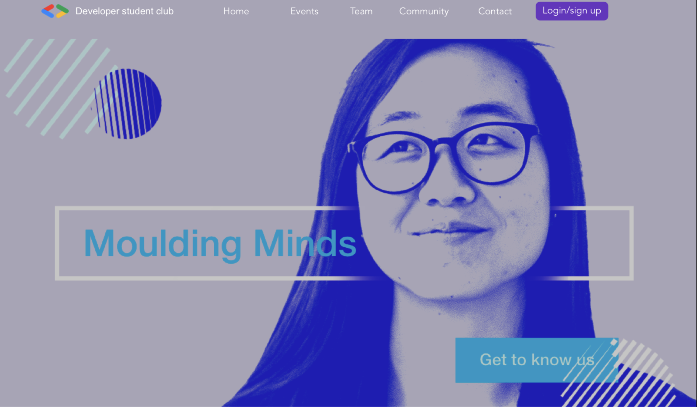

<h1 align="center"><strong>DSC - Douglas College Website Contest</strong></h1>

<!--

  

 
-->

 
 

<h2>🎯 <strong>Objective</strong></h2>

This repository intends to host the implementation of the DSC website contest.

 

<h2>🔍 <strong>Requirements</strong></h2>

👉 <a href="./assets/files/frontend_requirements.pdf" target="_blank">Link</a>

<!-- 
<ul>
  <li><strong><u>S</u></strong>ingle Responsability Principle</li>
  <li><strong><u>O</u></strong>pen-Closed Principle</li>
  <li><strong><u>L</u></strong>iskov Substitution Principle</li>
  <li><strong><u>I</u></strong>nterface Segregation Principle</li>
  <li><strong><u>D</u></strong>ependency Inversion Principle</li>
</ul>
-->
 

<h2>👥 <strong>Contributors</strong></h2>
<ul>
  <li>
    <a href="https://github.com/RowatEDouglas">
      Ethan Rowat
    </a>
  </li>
  <li>
    <a href="https://github.com/developer-jiheui">
      Jiheui Lee
    </a>
  </li>
  <li>
    <a href="https://github.com/melj">
      Melissa Johnson
    </a>
  </li>
</ul>
 

<h2>📝 <strong>References</strong></h2>
<!-- <ol>
  
S.O.L.I.D related:

  <li>
    <a href="https://www.digitalocean.com/community/conceptual_articles/s-o-l-i-d-the-first-five-principles-of-object-oriented-design">
        SOLID: The First 5 Principles of Object Oriented Design
    </a>
  </li>
</ol> -->
 

<h2>🔐 <strong>License</strong></h2>

Copyright © 2021 - This project is <a href="./LICENSE">MIT</a> licensed.

